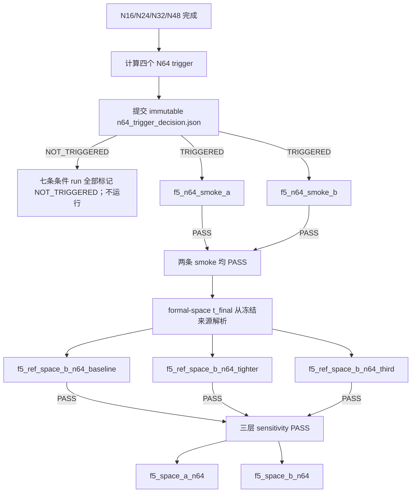

# Stage 01F5-P N64 条件依赖图

## 阻断规则

- 未提交 trigger decision：任何 N64 条目均不得运行。
- NOT_TRIGGERED：七条条件条目全部记为 `NOT_TRIGGERED`，不得运行。
- 任一 smoke 失败：不得运行 N64 reference 或正式 N64。
- Formal-space `t_final` 未从冻结来源解析：不得运行三层 reference；执行 manifest 状态为 incomplete。
- 任一 reference 或 sensitivity 失败：不得运行正式 N64。

当前审计停在 formal-space `t_final` 参数缺口之前；事实上因执行 manifest 不完整，连 smoke 也未获启动资格。本阶段所有节点的数值执行计数均为 0。
